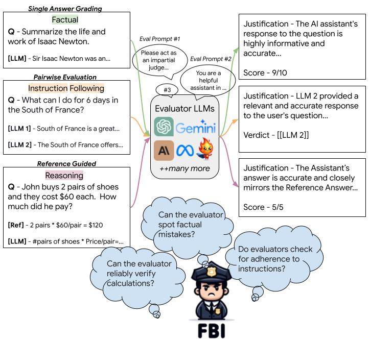

# FBI: Finding Blindspots in LLM Evaluations with Interpretable Checklists

[📜 Paper](https://arxiv.org/abs/2406.xxxxx) | [📝 Blogpost](https://ai4bharat.github.io/fbi) | [🤗 HF Dataset](https://huggingface.co/datasets/ai4bharat/fbi)

We present FBI, our novel meta-evaluation framework designed to assess the robustness of evaluator LLMs across diverse tasks and evaluation strategies. Please refer to our [paper]() and [blog]() for more details.

<p align="center" width="100%">
      
</p>

## Setup

To run perturbation generation and evaluation, you need to install the required packages by running the following command:

```bash
pip install -r requirements.txt
```

Setup required API keys to make the API calls.
```bash
export OPENAI_API_KEY=[ADD_YOUR_OPENAI_API_KEY]
export CLAUDE_API_KEY=[ADD_YOUR_CLAUDE_API_KEY]
export GEMINI_API_KEY=[ADD_YOUR_GEMINI_API_KEY]
export LLAMA3_API_KEY=[ADD_LLAMA3_API_KEY]
export LLAMA3_BASE_URL=[ADD_LLAMA3_BASE_URL]
```
We use hosted services for using Llama-3-70B-Instruct Model.

## Generate Perturbations

To generate perturbations, specify the desired task ability, model, and other parameters. This will create a `FILENAME.jsonl`, that can be used to create a [Batch API](https://platform.openai.com/docs/guides/batch) call to get the model outputs.

Sample perturbations across all the 22 categories are available at [here](assets/sample_perturbations/)!!!

Use the following command to generate the jsonl:
```bash
python -m perturbations.perturbations \
  --data_dir DATA_DIR \
  --file_name PATH_TO_PROMPTS_AND_ANSWERS \
  --subset TASK_ABILITY \
  --model MODEL_NAME \
  --temperature TEMP \
  --top_p TOP_P \
  --max_tokens MAX_TOKENS \
  --frequency_penalty FREQ_PEN \
  --debug
```

- `DATA_DIR`: Directory containing the data.
- `PATH_TO_PROMPTS_AND_ANSWERS`: Path to the file with prompts and answers.
- `TASK_ABILITY`: Specify the type of task (choose from `['factual', 'reasoning', 'instruction-following', 'long-form']`).
- `MODEL_NAME`: Name of the model to use.
- `TEMP`: Sampling temperature (controls the randomness of predictions).
- `TOP_P`: Top-p sampling parameter (controls the diversity of predictions).
- `MAX_TOKENS`: Maximum number of tokens to generate.
- `FREQ_PEN`: Frequency penalty (controls the repetition of tokens).
- `--debug`: Optional flag to enable debug mode.


Once you have the `.jsonl` file, create a batch request using the following command:

```bash
python batch_call.py \
  --create_batch \
  --input_file_name FILENAME.jsonl \
  --data_path DATA_DIR \
  --job_desc "JOB_DESC"
```

- `--create_batch`: Flag to indicate the creation of a batch request.
- `FILENAME.jsonl`: The name of the input file (in `.jsonl` format) containing the outputs.
- `DATA_DIR`: Path to the directory where the data is stored.
- `JOB_DESC`: Description of the job for the batch request.

## Run Evaluation
To run evaluations, we again create a batch jsonl file `FILENAME.jsonl` and use this for getting model outputs either using Batch API or regular API. We support the following LLM Evaluation strategies (please refer to the paper for more details on each strategy):
### Single Answer Evaluation
- single_vanilla
- single_vanilla_cot
- single_rubrics
- single_axes
- single_axes_rubrics

### Pairwise Comparison
- compare_vanilla
- compare_vanilla_cot
- compare_rules
- compare_axes
- compare_axes_rules

### Reference-guided Evaluation
- reference_based

Use the below command to generate the jsonl file:
```bash
python llm_evaluators/<EVAL_METHOD>.py \
  --data_dir DATA_DIR \
  --file_name PATH_TO_PROMPTS_AND_ANSWERS \
  --subset TASK_ABILITY \
  --model MODEL_NAME \
  --temperature TEMP \
  --top_p TOP_P \
  --max_tokens MAX_TOKENS \
  --frequency_penalty FREQ_PEN \
  --debug
```


## Citation

If you used this repository or our models, please cite our work:

```bibtex

```
